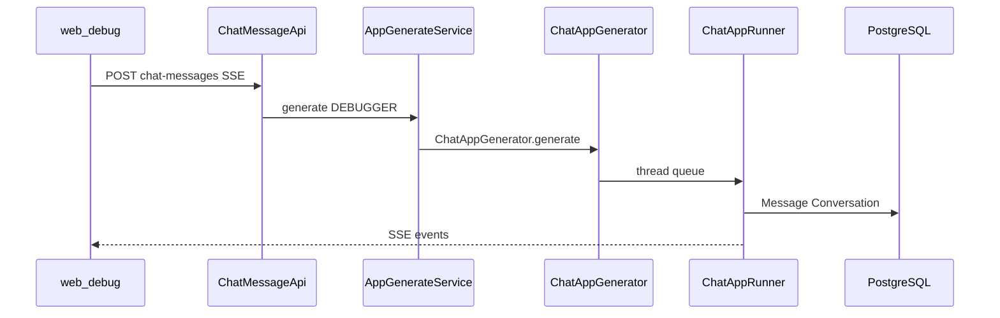

# Dify 工程树、功能全景与循序渐进学习路径

本文档落实仓库内的自学计划：先建立目录心智模型，再按产品域对照源码，并给出分阶段练习与可验证成果。计划原文见 Cursor 计划「Dify 能力学习地图」；**请勿与计划文件混用**——以本文为准做日常学习。

---

## 一、工程树与目录说明（先看这里）

```text
dify/
├── api/                 # 主后端：Flask + DDD，业务 API、工作流引擎、RAG、模型调用
├── web/                 # 控制台与 WebApp 前端：Next.js + TypeScript + React
├── dify-agent/          # 独立 Agent 运行时与 Agenton 文档（与主 api 的 agent 能力协同）
├── docker/              # 自托管：compose、中间件、env 分层
├── packages/            # 前端 monorepo 共享包（dify-ui、contracts、dev-proxy 等）
├── e2e/                 # Cucumber + Playwright 端到端测试
├── sdks/                # 对外 API 客户端示例（Node、PHP）
├── docs/                # 多语言 README / 贡献指南（含本文）
├── dev/                 # 本地开发脚本（setup、start-api/web/worker）
├── scripts/             # 压测、工具脚本
├── .github/             # CI/CD workflows
├── AGENTS.md            # 仓库级 AI/贡献约定
└── Makefile             # format、test 等
```

### 1.1 `api/` — 后端核心

| 目录 | 作用 |
|------|------|
| `controllers/` | HTTP 入口：`console/`（管理台）、`web/`（已发布应用）、`service_api/`（BaaS）、`files/`、`trigger/`、`mcp/`、`inner_api/` |
| `services/` | 应用服务层：编排 DB、Celery、外部 I/O |
| `core/` | 领域核心：workflow、agent、rag、tools、plugin、mcp、moderation、telemetry |
| `models/` | SQLAlchemy 模型 |
| `repositories/` | 大表/复杂查询 |
| `tasks/` + `schedule/` | Celery 异步与定时任务 |
| `migrations/` | Alembic 迁移 |
| `extensions/` | DB、Redis、Celery、存储、邮件、OTel、Sentry、Socket.IO |
| `configs/` | 统一配置（`dify_config`） |
| `enterprise/` | 企业版逻辑 |

分层约定：**controller → service → core/domain**，共享资源必须带 `tenant_id`。

### 1.2 `web/` — 前端

| 目录 | 作用 |
|------|------|
| `app/` | Next.js 页面路由 |
| `service/` | 后端 API 封装（含 `ssePost` 流式） |
| `contract/` | API 类型契约 |
| `i18n/` | 用户可见文案 |

### 1.3 `dify-agent/`

- `src/agenton`、`src/dify_agent`：Agent 运行时
- `docs/`：Agenton / dify-agent 文档（目录内 `make docs`）
- 与主站：`api/controllers/console/agent/`、`api/services/agent/`

### 1.4 `docker/`

- `docker-compose.yaml`：全栈自托管
- `docker-compose.middleware.yaml` + `middleware.env`：仅中间件（本地源码开发常用）
- `envs/`：按主题拆分的环境变量

### 1.5 `packages/`

- `dify-ui`：设计系统与 overlay 契约
- `contracts`：跨包类型
- `dev-proxy`：本地开发代理

---

## 二、功能与能力全景（按领域）

与 [README 七大特性](../README.md) 一致，下列为**代码落点速查**。

| 领域 | 产品能力摘要 | 主要代码 |
|------|----------------|----------|
| 应用形态 | Chat / Agent Chat / Completion / Workflow / RAG Pipeline / Channel | `api/models/model.py` `AppMode`，`api/core/app/` |
| 工作流 | 画布、草稿变量、运行/暂停、触发器 | `api/core/workflow/`，`api/models/workflow.py` |
| Agent | FC、ReAct(CoT)、工具、MCP | `api/core/agent/`，`api/core/tools/`，`dify-agent/` |
| RAG | 数据集、索引、命中测试、Pipeline | `api/core/rag/`，`api/services/dataset_service.py` |
| 模型 | 多厂商 Provider、负载均衡 | `api/core/model_manager.py`，`api/core/provider_manager.py` |
| 对话 | 会话、消息、End User | `api/models/model.py`，`controllers/web/` |
| 账号 | 租户、角色、OAuth、API Key | `api/models/account.py`，`controllers/console/auth/` |
| 插件 | 安装、升级、工作流节点 | `api/services/plugin/`，`api/core/plugin/` |
| 触发器 | Webhook、定时 | `api/controllers/trigger/`，`api/core/trigger/` |
| LLMOps | 标注、统计、日志清理 | `api/services/annotation_service.py`，`api/schedule/` |
| 可观测 | Langfuse 等 Trace、OTel | `api/core/ops/`，`api/extensions/ext_otel.py` |
| BaaS | Service API、SDK 示例 | `api/controllers/service_api/`，`sdks/` |

---

## 阶段 0：环境与地图（可验证成果）

### 0.1 命令清单（推荐顺序）

```bash
# 1) 复制 env 并安装依赖
./dev/setup

# 2) 检查 api/.env、web/.env.local、docker/middleware.env（SECRET_KEY 等）

# 3) 启动中间件（PostgreSQL / Redis / 向量库等）
./dev/start-docker-compose
# 或仅中间件：见 docker/README.md 与 docker-compose.middleware.yaml

# 4) 启动 API（含迁移）
./dev/start-api

# 5) 启动前端
./dev/start-web

# 6) 异步任务（索引、邮件等需要）
./dev/start-worker

# 可选定时任务
./dev/start-beat
```

浏览器访问：`http://localhost:3000`（安装/初始化见 `/install`、`/init`）。

更细说明见 [api/README.md](../../api/README.md)。

### 0.2 控制台练习（产品地图）

在 UI 各完成一次，建立「功能 ↔ 菜单」映射：

| 练习 | 路由参考 | 对应后端域 |
|------|----------|------------|
| 创建 **Chat** 应用 | `/apps` → 应用 → 编排 / 调试 | `AppMode.CHAT`，`core/app/apps/chat/` |
| 创建 **Dataset** 并上传文档 | `/datasets` | `dataset_service`，`tasks/*indexing*` |
| 创建 **Workflow** 应用并拖一个 LLM 节点 | `/app/[appId]/workflow` | `core/workflow/`，`WorkflowEntry` |

**阶段 0 成果**：能登录控制台并完成上述三项创建；知道 `api/` 与 `web/` 目录职责。

---

## 阶段 1：Chat 调试一条消息（端到端链路）

以控制台 **应用编排 → 调试 → 发送聊天消息** 为例（SSE 流式）。

### 1.1 前端

| 步骤 | 文件 | 说明 |
|------|------|------|
| 1 | `web/app/components/app/configuration/debug/debug-with-single-model/index.tsx` | `ssePost(\`apps/${appId}/chat-messages\`, …)` |
| 2 | `web/service/base.ts`（`ssePost`） | 封装 EventSource/SSE，拼控制台 API 前缀 |
| 3 | 停止生成 | `web/service/debug.ts` → `POST apps/{id}/chat-messages/{taskId}/stop` |

### 1.2 后端 HTTP

| 步骤 | 文件 | 说明 |
|------|------|------|
| 4 | `api/controllers/console/app/completion.py` | `ChatMessageApi.post` → `/console/api/apps/<app_id>/chat-messages` |
| 5 | 鉴权装饰器 | `@login_required`、`@get_app_model(mode=[CHAT, AGENT_CHAT])` |

### 1.3 生成编排

| 步骤 | 文件 | 说明 |
|------|------|------|
| 6 | `api/services/app_generate_service.py` | `AppGenerateService.generate()` 按 `AppMode` 分支 |
| 7a | Chat | `ChatAppGenerator` → `api/core/app/apps/chat/app_generator.py` |
| 7b | Agent Chat | `AgentChatAppGenerator` → `api/core/app/apps/agent_chat/app_generator.py` |
| 8 | Runner | `ChatAppRunner` / `AgentChatAppRunner`（`app_runner.py`） |
| 9 | 模型调用 | `core/model_manager.py` → `graphon` model runtime |
| 10 | 持久化 | `api/models/model.py`：`Conversation`、`Message`、`MessageAgentThought`（Agent 时） |

### 1.4 链路简图



### 1.5 Workflow 草稿运行（备选链路）

| 步骤 | 文件 |
|------|------|
| UI | 工作流画布运行 → 调 `apps/{id}/workflows/draft/run` |
| API | `api/controllers/console/app/workflow.py` `DraftWorkflowRunApi` |
| 服务 | 同样 `AppGenerateService.generate` → `AppMode.WORKFLOW` → `WorkflowAppGenerator` |
| 引擎 | `api/core/workflow/workflow_entry.py` `WorkflowEntry.run()` → `GraphEngine` |

**阶段 1 成果**：能口述 8–10 个关键文件；Network 里能看到 `chat-messages` 或 `workflows/draft/run`。

---

## 阶段 2：RAG — 文档上传到可检索（8 步）

### 2.1 产品操作路径

上传文档 → 等待索引完成 → **命中测试**（`/datasets/[id]/hitTesting`）。

### 2.2 八步与代码

| 步 | 动作 | 代码落点 |
|----|------|----------|
| 1 | 创建/更新数据集 | `api/services/dataset_service.py`，`api/models/dataset.py` `Dataset` |
| 2 | 上传文件入对象存储 | `api/services/file_service.py`，`api/extensions/storage/` |
| 3 | 创建 `Document` 记录 | `DocumentService.save_document_with_dataset_id`（约 1967 行起） |
| 4 | 投递索引任务 | `DocumentIndexingTaskProxy(...).delay()`（约 2273 行） |
| 5 | Celery 消费 | `api/tasks/document_indexing_task.py` → `_document_indexing` |
| 6 | 解析/分段/清洗 | `api/core/indexing_runner.py`（`IndexingRunner`） |
| 7 | 写入向量库/关键词索引 | `api/core/rag/index_processor/`，`Keyword`，各 vector store 适配 |
| 8 | 命中测试查询 | `api/controllers/console/datasets/hit_testing.py` → `HitTestingService.retrieve` → `core/rag/datasource/retrieval_service.py` |

### 2.3 命中测试 API

- 控制台：`POST /console/api/datasets/<dataset_id>/hit-testing`
- 开放 API：`api/controllers/service_api/dataset/hit_testing.py`（含 `/retrieve` 别名）
- 核心：`api/services/hit_testing_service.py` 的 `retrieve()` / `external_retrieve()`

### 2.4 配置关联

向量库类型与连接串在 **`docker/middleware.env`** / **`api/.env`** 与 `configs` 中，不要在前端写死。

**阶段 2 成果**：能按上表向他人讲解「上传 PDF 后为何能在命中测试里看到分段」。

---

## 阶段 3：Agent 与工具（FC vs ReAct）

### 3.1 策略如何选择

入口：`api/core/app/apps/agent_chat/app_runner.py`（约 197–210 行）：

1. 若模型 schema 支持 `TOOL_CALL` / `MULTI_TOOL_CALL` → 策略设为 **FUNCTION_CALLING** → `FunctionCallAgentRunner`（`api/core/agent/fc_agent_runner.py`）。
2. 若配置为 **CHAIN_OF_THOUGHT**（ReAct）：
   - LLM `mode == chat` → `CotChatAgentRunner`
   - LLM `mode == completion` → `CotCompletionAgentRunner`
   - 基类逻辑在 `api/core/agent/cot_agent_runner.py`

`AppGenerateService` 在 `AppMode.AGENT_CHAT`（或 Chat + `is_agent`）时走 `AgentChatAppGenerator` → `AgentChatAppRunner`。

### 3.2 工具与观测

| 能力 | 代码 |
|------|------|
| 内置/自定义工具 | `api/core/tools/tool_manager.py` 等 |
| 插件工具 | `api/core/plugin/` |
| MCP | `api/core/mcp/`，模型 `AppMCPServer` |
| 思考链落库 | `api/models/model.py` `MessageAgentThought` |

### 3.3 dify-agent 子项目

- 文档：`dify-agent/docs/`（`dify-agent/README.md` 中的链接）
- 本地测试：`cd dify-agent && make test`
- 与控制台 Agent 编排：`api/controllers/console/agent/`，`api/services/agent/`

**阶段 3 成果**：能指出 FC 与 ReAct 分支文件各 1 个，并说明工具调用结果存在哪张表。

---

## 阶段 4：工作流引擎 — 单节点执行顺序

### 4.1 从草稿运行进入

1. `DraftWorkflowRunApi.post`（`workflow.py`）→ `AppGenerateService.generate(WORKFLOW)`
2. `WorkflowAppGenerator.generate`（`api/core/app/apps/workflow/app_generator.py`）
3. 构建 `WorkflowEntry`（`api/core/workflow/workflow_entry.py`）

### 4.2 GraphEngine 运行时

`WorkflowEntry.__init__` 会：

- 创建 `GraphEngine`（`graphon.graph_engine`）
- 挂载层：`ExecutionLimitsLayer`（步数/时间）、`LLMQuotaLayer`、可选 `ObservabilityLayer`（OTel）
- `run()`：`yield from graph_engine.run()`，产出 `GraphEngineEvent`

节点实现目录：`api/core/workflow/nodes/`（如 `agent`、`knowledge_retrieval`、`trigger_webhook` 等）。

### 4.3 事件与前端

- 控制台 Socket.IO：`api/controllers/console/socketio/workflow.py`
- 运行记录模型：`api/models/workflow.py` `WorkflowRun`、`WorkflowNodeExecutionModel`

### 4.4 节点执行概念顺序

```text
调度就绪节点 → GraphEngine 执行节点类型 handler
  → 读写 VariablePool / 草稿变量
  → 可能调用 LLM、检索、工具、子工作流
  → 发出 GraphNodeEventBase 等事件
  → 持久化 node execution（及 offload 大 payload）
  → 沿边激活下游节点；直至结束或失败/暂停
```

**阶段 4 成果**：能说明「草稿运行」与 `WorkflowEntry` / `GraphEngine` 的关系，并列举 3 种节点目录名。

---

## 阶段 5：平台能力（按需深入）

### 5.1 用户、租户、认证

| 主题 | 代码 |
|------|------|
| 模型 | `api/models/account.py`：`Account`、`Tenant`、`TenantAccountJoin` |
| 登录注册 | `api/controllers/console/auth/login.py` 等 |
| Token/Cookie | `api/libs/token.py`，`api/extensions/ext_login.py` |
| 当前用户 | `api/libs/login.py` `current_account_with_tenant` |

### 5.2 可观测性

| 主题 | 代码 |
|------|------|
| 应用 Trace（Langfuse 等） | `api/controllers/console/app/ops_trace.py`，`api/core/ops/` |
| OTel | `api/extensions/ext_otel.py`，`api/core/telemetry/` |
| Sentry | `api/extensions/ext_sentry.py` |

### 5.3 BaaS 与集成

| 主题 | 代码 |
|------|------|
| Service API 路由注册 | `api/controllers/service_api/__init__.py` |
| 对话/工作流/数据集 | `service_api/app/`，`service_api/dataset/` |
| SDK 示例 | `sdks/nodejs-client`，`sdks/php-client` |
| OpenAPI | `api/openapi/` |

### 5.4 企业 / 计费 / 功能开关

- `api/enterprise/`，`api/services/billing_service.py`
- `api/services/feature_service.py`（套餐、批量上传限制等，索引任务也会查）

**阶段 5 成果**：知道控制台登录与 Service API 是两套入口；Trace 配置在应用级 `ops_trace` 接口。

---

## 阶段 6：贡献级（延伸）

- 规范：[api/AGENTS.md](../../api/AGENTS.md)、[web/AGENTS.md](../../web/AGENTS.md)
- 质量：`make lint` / `make test`（api），`pnpm lint:fix` / `pnpm type-check`（web）
- E2E：`e2e/README.md`
- CI：`.github/workflows/api-tests.yml` 等

---

## 五、推荐阅读顺序

1. [README.md](../../README.md) / [docs/zh-CN/README.md](./README.md)
2. https://docs.dify.ai
3. [api/README.md](../../api/README.md)
4. [dify-agent/README.md](../../dify-agent/README.md)
5. [web/docs/test.md](../../web/docs/test.md)、[web/docs/lint.md](../../web/docs/lint.md)

---

## 六、自学节奏建议

| 周次 |  focus | 成果检验 |
|------|--------|----------|
| 第 1 周 | 阶段 0 + 1 | 本地跑通 + Chat 链路笔记 |
| 第 2 周 | 阶段 2 | 画出 RAG 8 步 |
| 第 3 周 | 阶段 3 | 解释 FC/ReAct 分支 |
| 第 4–5 周 | 阶段 4 | 工作流事件与一种自定义节点阅读 |
| 按需 | 阶段 5–6 | 接入 Service API 或提交小 PR |

不必一次读完第二节全部领域；**每阶段一个可验证成果**即可。

---

*文档版本：与仓库 main 结构同步，行号引用以当前文件为准，升级后请以代码为准核对。*
